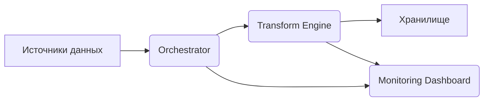

# DataPipeline Hub: унифицированная платформа обработки данных

[](https://opensource.org/licenses/MIT)

## Описание проекта

**DataPipeline Hub** — открытая платформа для построения, мониторинга и управления ETL‑пайплайнами. Решение предназначено для команд, работающих с разнородными источниками данных (SQL, NoSQL, API, файлы).

### Ключевые возможности

- **Унифицированный интерфейс** для настройки пайплайнов без программирования.
- **Автоматическое логирование** всех этапов обработки.
- **Мониторинг в реальном времени** (метрики, алерты, дашборды).
- **Поддержка облачных хранилищ** (S3, GCS, Azure Blob).
- **Масштабируемость** через контейнеризацию (Docker, Kubernetes).

## Архитектура

Система состоит из трёх основных компонентов:

1. **Orchestrator**  
   Управление workflow, планирование задач, обработка ошибок.

2. **Transform Engine**  
   Выполнение преобразований данных (очистка, агрегация, обогащение).

3. **Monitoring Dashboard**  
   Визуализация метрик, алерты, аудит изменений.



## Технологии

- **Backend**: Python 3.11, Apache Airflow, FastAPI
- **БД**: PostgreSQL, Redis
- **Контейнеризация**: Docker, Kubernetes
- **CI/CD**: GitHub Actions
- **Мониторинг**: Prometheus, Grafana
- **Документация**: MkDocs

## Установка

1. Клонируйте репозиторий:
   ```bash
   git clone https://github.com/shivtsovvlad/datapipeline-hub.git
   ```

2. Установите зависимости:
   ```bash
   pip install -r requirements.txt
   ```

3. Настройте окружение (см. `config/sample.env`).

4. Запустите сервис:
   ```bash
   docker-compose up -d
   ```

## Использование

1. Перейдите в веб‑интерфейс: `http://localhost:8000`.
2. Создайте новый пайплайн через визуальный конструктор.
3. Настройте источники и цели данных.
4. Запустите выполнение и отслеживайте статус в дашборде.

## Документация

Полная документация доступна в разделе [`docs/`](docs/README.md).

## Вклад в проект

Мы приветствуем:
- Исправление ошибок (через Issues).
- Новые фичи (через Pull Requests).
- Улучшение документации.

Перед внесением изменений ознакомьтесь с [`CONTRIBUTING.md`](CONTRIBUTING.md).

## Лицензия

Проект распространяется под лицензией [MIT](LICENSE).

## Контакты

- **Автор**: Владислав Шивцов
- **Email**: shivtsovvlad@gmail.com
- **Telegram**: @DataArchitectPro

---

*Последнее обновление: 2025-11-27*

