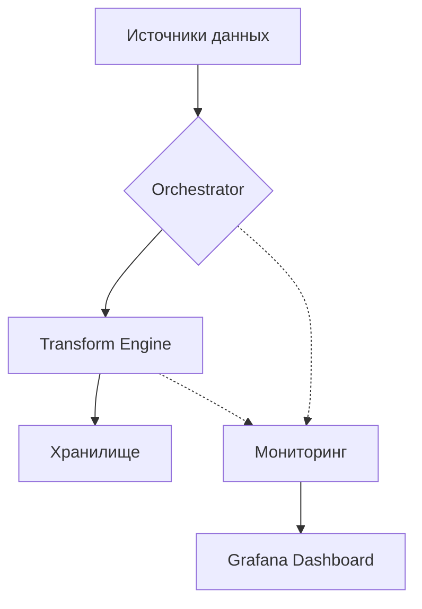

# Документация DataPipeline Hub

## Введение

Этот раздел содержит полную документацию по платформе **DataPipeline Hub** — от архитектуры до детальных инструкций по настройке.

## Содержание

1. [Архитектура системы](#архитектура-системы)  
2. [Настройка окружения](#настройка-окружения)  
3. [Конфигурация пайплайнов](#конфигурация-пайплайнов)  
4. [API Reference](#api-reference)  
5. [Мониторинг и логирование](#мониторинг-и-логирование)  
6. [Best Practices](#best-practices)  
7. [FAQ](#faq)

---

## Архитектура системы

### Основные компоненты

1. **Orchestrator**  
   - Управление workflow через Apache Airflow.  
   - Планирование задач (cron‑подобные расписания).  
   - Обработка ошибок и повторные попытки.

2. **Transform Engine**  
   - Выполнение Python‑скриптов для трансформации данных.  
   - Поддержка UDF (пользовательских функций).  
   - Параллельная обработка пакетов.

3. **Monitoring Dashboard**  
   - Визуализация метрик в Grafana.  
   - Алерты через Slack/Email.  
   - История выполнения пайплайнов.

### Схема взаимодействия



---

## Настройка окружения

### Требования

- Python 3.11+  
- Docker 20.10+  
- PostgreSQL 14+  
- Redis 6+

### Шаги установки

1. Клонируйте репозиторий:  
   ```bash
   git clone https://github.com/shivtsovvlad/datapipeline-hub.git
   ```

2. Создайте `.env` на основе `config/sample.env`:  
   ```ini
   DB_HOST=localhost
   DB_PORT=5432
   REDIS_HOST=localhost
   # ... остальные параметры
   ```

3. Запустите сервисы:  
   ```bash
   docker-compose up -d
   ```

4. Проверьте статус:  
   ```bash
   docker-compose ps
   ```

---

## Конфигурация пайплайнов

### Формат YAML

Пример конфигурации (`pipelines/example.yaml`):

```yaml
pipeline:
  name: sales_etl
  schedule: "0 2 * * *"  # ежедневно в 2:00
  steps:
    - name: extract_sales
      type: sql_query
      config:
        query: "SELECT * FROM sales WHERE date > '{{prev_run}}'"
        target: staging.sales_raw
    - name: clean_data
      type: python_script
      config:
        script: scripts/clean_sales.py
        input: staging.sales_raw
        output: staging.sales_clean
```

### Доступные типы шагов

- `sql_query` — выполнение SQL.  
- `python_script` — запуск Python‑кода.  
- `api_call` — запрос к REST API.  
- `file_load` — загрузка файлов (CSV, JSON).

---

## API Reference

### Основные эндпоинты

- `GET /api/v1/pipelines` — список всех пайплайнов.  
- `POST /api/v1/pipelines/{id}/run` — запуск пайплайна.  
- `GET /api/v1/metrics` — текущие метрики системы.  
- `GET /api/v1/logs/{pipeline_id}` — логи выполнения.

### Пример запроса

```bash
curl -X POST http://localhost:8000/api/v1/pipelines/sales_etl/run \
  -H "Content-Type: application/json" \
  -d '{"force_rerun": false}'
```

---

## Мониторинг и логирование

### Ключевые метрики

- `pipeline_duration` — время выполнения пайплайна.  
- `records_processed` — количество обработанных записей.  
- `error_count` — число ошибок.  
- `cpu_usage` — загрузка CPU.

### Доступ к дашбордам

1. Grafana: `http://localhost:3000`  
2. Prometheus: `http://localhost:9090`  
3. Airflow UI: `http://localhost:8080`

### Логирование

Логи хранятся в:  
- `/var/log/datapipeline-hub/` (на хосте).  
- Таблице `logs` в PostgreSQL.

---

## Best Practices

1. **Именование пайплайнов**  
   Используйте префиксы: `etl_`, `analytics_`, `reporting_`.

2. **Обработка ошибок**  
   Всегда указывайте `on_failure`‑действия в YAML.

3. **Версионирование**  
   Храните конфигурации пайплайнов в Git.

4. **Тестирование**  
   Запускайте пайплайны в режиме `--dry-run` перед продакшеном.

---

## FAQ

**Q: Как добавить новый источник данных?**  
A: Создайте коннектор в `connectors/` и обновите `config/sources.yaml`.

**Q: Почему пайплайн падает с ошибкой «MemoryError»?**  
A: Увеличьте `MEMORY_LIMIT` в `.env` или оптимизируйте запросы.

**Q: Где посмотреть историю запусков?**  
A: В Airflow UI → вкладку «DAGs» → выберите пайплайн.

**Q: Как настроить алерты?**  
A: Измените `alerts.yaml` и перезапустите Orchestrator.

---

*Документация актуальна на: 2025-11-27*  
*Для предложений по улучшению — создайте Issue в репозитории.*
